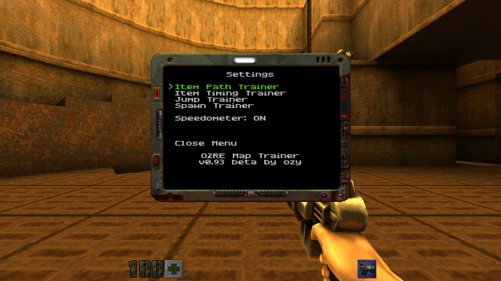
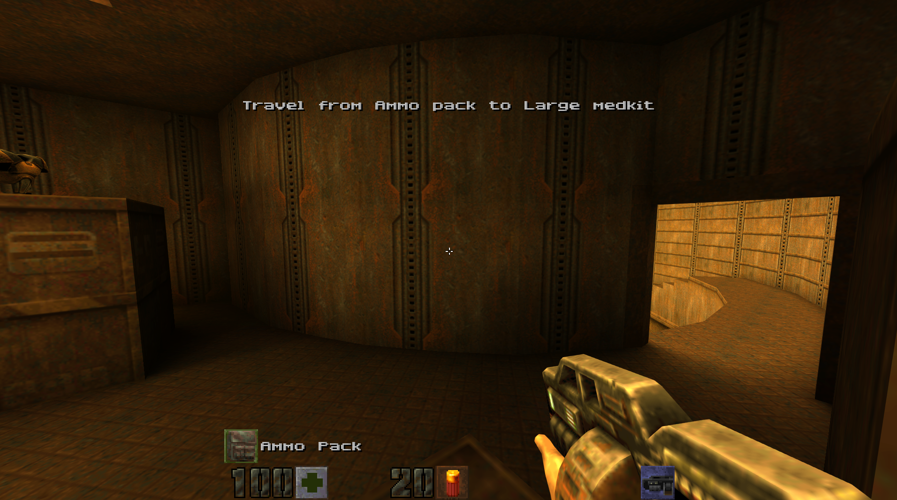
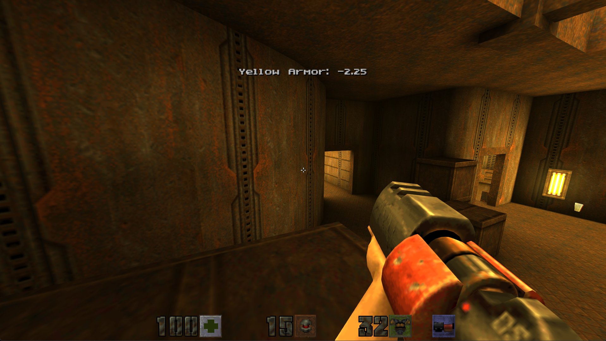

# Quake 2 Rerelease Map Trainer

A training mod for Quake 2 Rerelease that helps players learn maps, improve item timing, and practice movement mechanics.
---

## 🎯 Features

### 📍 **Item Path Training**
Guides you through items on the map in a randomized sequence. Perfect for learning optimal item routes and map layouts.

- Automatically detects all items from the map (no setup required!)
- Shows you which item to collect next
- Customizable: enable/disable weapons, ammo, health, armor, or powerups
- Great for learning new maps quickly

### ⏱️ **Item Timing Training**
Provides precise feedback on your item respawn timing accuracy.

- Tracks armor, weapons, powerups, and megahealth
- Shows if you were early or late (in seconds/frames)
- Special megahealth handling (accounts for decay time)
- Perfect for competitive duel practice

### 🦘 **Jump Trainer**
Practice movement mechanics and difficult jumps.

- **Save/Load Position**: Save spawn points for jump practice
- **Bhop Consistency**: Get real-time feedback on bunny hop timing
- **Speedometer**: Track your movement speed

### 🎲 **Spawn Trainer**
Learn spawn point locations and practice spawn awareness.

- **Spawn Bot**: Creates a bot that respawns at different spawn points
- **Spawn Order**: Choose between vanilla spawn order or random (no repeat)
- **Beacon Beep**: Audio cue to help locate spawn points
- Perfect for learning spawn locations and practicing spawn awareness

---

## 📸 Screenshots







---

## 📥 Installation

1. **Download** `game_x64.dll` from the latest release
2. **Copy** it to your Quake 2 baseq2 folder:
   ```
   <Steam>\steamapps\common\Quake 2\rerelease\baseq2\
   ```
   Example:
   ```
   C:\Program Files (x86)\Steam\steamapps\common\Quake 2\rerelease\baseq2\game_x64.dll
   ```
3. **Launch** Quake 2 Rerelease

**That's it!** The trainer is now active.

---

## 🎮 Quick Start

### Opening the Menu
Press **TAB** to open the trainer menu (or type `maptrainer` in console).

### Recommended Key Bindings
Open the console (~) and type:
```
bind F5 "savepos"
bind F6 "loadpos"
bind TAB "maptrainer"
```

Now you can:
- **F5**: Save your current position
- **F6**: Teleport back to saved position
- **TAB**: Open the trainer menu

---

## 📖 Usage Guide

### Item Path Training

1. Open the menu (TAB)
2. Select **"Item Path Trainer"**
3. Enable **"Path Trainer: OFF"** (toggles to ON)
4. Configure item categories (weapons, health, armor, etc.)
5. Close menu and play
6. Pick up the highlighted item, then go to the next one shown

**Tips:**
- Disable item types you don't care about (e.g., turn off ammo for faster routes)
- Use "Combine Health Packs" to treat all health packs as one target
- Item categories follow the SDK item registry (`IF_WEAPON`, `IF_HEALTH`, etc.); mod items with proper flags respect the matching toggle even if their classname is unconventional
- Great for learning optimal item collection routes

### Item Timing Training

1. Open the menu (TAB)
2. Select **"Item Timing Trainer"**  
3. Enable **"Timing Trainer: Disabled"** (toggles to Enabled)
4. Close menu and play
5. Pick up a major item (armor, weapon, powerup, megahealth)
6. Return to that item's spawn point when you think it's about to respawn
7. You'll see feedback: **"Red Armor: +0.25"** (you were 0.25 seconds late)

**Tips:**
- **Positive numbers** = late (item already spawned)
- **Negative numbers** = early (item hasn't spawned yet)
- Enable "Free Collect" to pick up armor even when at max (for easier practice)
- Enable "Debug Prints" for detailed timing information

**Megahealth timing**: The trainer automatically handles megahealth's special timing - it waits for your health to decay to 100, THEN starts the 20-second timer.

### Jump Trainer / Bhop Practice

1. Open the menu (TAB)
2. Select **"Item Jump Trainer"**
3. Enable features you want:
   - **Save/Load Position**: Practice specific jumps repeatedly
   - **Bhop Consistency**: Get feedback on your bunny hop timing

**Bhop Feedback:**
- **"Perfect"**: Jump within one server tick after landing
- **"Late (Nms)"**: You waited N milliseconds too long on the ground
- **"Early/Held"**: You held jump too early

**Tips:**
- Use savepos/loadpos for practicing difficult jumps
- Bhop trainer only gives feedback during active bhop chains (not your first jump)
- Chain resets after standing still for ~1 second

### Speedometer

Enable from the main menu to see your horizontal movement speed in real-time. Great for optimizing strafe jumping and maintaining speed through turns.

### Spawn Trainer

1. Open the menu (TAB)
2. Select **"Spawn Trainer"**
3. Enable **"Spawn Trainer: Disabled"** (toggles to Enabled)
4. A bot will spawn and respawn at different spawn points on the map
5. Configure options:
   - **Spawn Order**: Choose "Vanilla" (default game order) or "Random (No Repeat)" (random spawns without repeating)
   - **Beacon Beep**: Enable/disable audio beep to help locate spawn points

**Tips:**
- Use "Random (No Repeat)" to experience all spawn points on a map
- Enable beacon beep to hear where the bot spawns
- Great for learning spawn locations and practicing spawn awareness in duels
- The bot will automatically respawn when killed

---

## Design and limitations

The trainer is built for **one human practitioner plus bots** on a solo or listen server. All trainer configuration and runtime state lives in server-global structures (`level.map_trainer` / `game.map_trainer_config`), and center-print messages broadcast to every connected client. This is intentional — a per-client redesign would only matter if multi-human practice became a goal.

---

## ⚙️ Console Commands

| Command | Description |
|---------|-------------|
| `maptrainer` | Open the trainer menu |
| `savepos` | Save your current position and view angle |
| `loadpos` | Teleport to your saved position |
| `trainer_debug 1` | Enable debug logging to `trainer.log` |
| `trainer_debug 0` | Disable debug logging |

### Persisted settings (archived cvars)

These are written automatically when you change options in the trainer menu. They survive game restarts.

| Cvar | Default | Description |
|------|---------|-------------|
| `trainer_mode` | `0` | Active trainer: `0` off, `1` path, `2` timing |
| `trainer_weapons` | `1` | Path trainer: include weapons |
| `trainer_ammo` | `1` | Path trainer: include ammo |
| `trainer_health` | `1` | Path trainer: include health |
| `trainer_armor` | `1` | Path trainer: include armor |
| `trainer_powerups` | `1` | Path trainer: include powerups |
| `trainer_combine_health` | `0` | Path trainer: combine health packs |
| `trainer_speedometer` | `1` | Speedometer enabled |
| `trainer_bhop` | `0` | Bhop consistency trainer |
| `trainer_free_collect` | `1` | Timing: free collect at max armor |
| `trainer_timing_major_only` | `1` | Timing: major items only |
| `trainer_timing_challenge` | `0` | Timing challenge: `0` off, `1`–`4` easy→pro |
| `trainer_spawn_intent` | `0` | Spawn trainer enabled (auto-resumes on map load) |
| `trainer_spawn_random` | `0` | Spawn order: `0` vanilla, `1` random |
| `trainer_spawn_beacon` | `1` | Spawn trainer beacon beep |

---


---

## 🗺️ Supported Maps

**All Quake 2 maps are supported!** The trainer automatically detects items from the map at runtime - no conversion or setup required.

Works with:
- Official Q2 maps (q2dm1-q2dm8, etc.)
- Community maps
- Custom maps
- Mission pack maps

---

## 🐛 Troubleshooting

### Menu won't open
- Make sure you're in a multiplayer map (deathmatch mode)
- Try typing `maptrainer` in the console instead of TAB

### Path training shows "No items found"
- Make sure you're on a deathmatch map (not single-player)
- Check that at least one item category is enabled in the menu

### Timing not working
- Make sure **Timing Trainer** is enabled (check menu)
- Path Training and Timing Training are mutually exclusive (enabling one disables the other)
- You need to be within pickup radius (64 units) of the item spawn for feedback

### Bhop trainer showing incorrect timing
- Make sure you're doing continuous bhops (jumping immediately after landing)
- The chain resets if you stand still for ~1 second
- First jump of a new chain is silent (not counted)

### Debug logging
If you encounter issues, enable debug logging:
```
trainer_debug 1
```
This creates a `trainer.log` file in your Quake 2 directory with detailed information.

---

## 🔧 Advanced Settings

### Free Collect Mode
Allows you to pick up armor even when at maximum capacity. Useful for timing practice without worrying about your current armor value.

### Combine Health Packs
Treats all health packs (small + medium) as a single target type. Useful for path training when you don't care about specific health pack sizes.

### Debug Prints (Timing)
Shows detailed debug information about timing calculations. Use this if you want to understand exactly how the timing trainer works.

---

## 📊 Technical Details

- **Timing Grace Period**: 5 seconds after pickup (prevents immediate re-timing)
- **Pickup Radius**: 64 units (standard Q2 pickup range)
- **Bhop Chain Timeout**: 1 second of standing still
- **Position Match Tolerance**: 32 units (for item detection)
- **Max Concurrent Timings**: 32 items

---

## 🙏 Credits

**Created by**: ozy  
**Version**: v1.1.0  
**Architecture**: "Thin vanilla" design - minimal changes to base game code  

Built with the Quake 2 Rerelease SDK  
Copyright (c) ZeniMax Media Inc.

---

## 📝 Changelog

### v1.1.0 (2026-06-20)
- **Settings now persist across map changes** — trainer configuration is retained when the map changes, and active trainers auto-resume on the new map (path training rebuilds the new map's item list, the spawn bot re-spawns, timings start fresh)
- Build environment overhaul — vcpkg is now a git submodule with a `setup-vcpkg.ps1` bootstrap; `build.bat`/`play.bat` moved to the repo root (build and deploy are separate steps)
- Consolidated version constants into `src/trainer/trainer_version.h` (single source of truth, alongside the repo-root `VERSION` file)
- Version bump to 1.1.0

### v0.94 beta
- Various bug and stability fixes

### v0.93 (2025-11-01)
- Refactored to "thin vanilla" architecture
- Fixed bhop chain detection (first jump no longer counted)
- Added centralized debug logging system (`trainer_debug` cvar)
- Fixed item timing duplicate debug messages
- Improved path training feedback
- Tightened position matching tolerance (128→32 units)
- Added version constant for easier updates
- Build output now goes to `dist/` directory

### v0.92
- Added bhop consistency tracking
- Improved megahealth timing logic
- Various bug fixes

### v0.87  
- Initial release
- Path training and timing features
- Jump trainer basics

---

## 🆘 Support

If you encounter bugs or have feature requests, please provide:
1. Description of the issue
2. Steps to reproduce
3. Map name
4. Contents of `trainer.log` (if `trainer_debug 1` was enabled)

---

**Good luck with your training! 🎯**


